# DotnetAgents Architecture & Implementation Documentation

## 📚 Table of Contents
1. [Project Overview](#project-overview)
2. [Architecture](#architecture)
3. [Project Structure](#project-structure)
4. [Current Implementation Status](#current-implementation-status)
5. [Data Flow](#data-flow)
6. [Configuration](#configuration)
7. [Database Schema](#database-schema)
8. [API Endpoints](#api-endpoints)
9. [Known Issues & Technical Debt](#known-issues--technical-debt)
10. [Future Enhancements](#future-enhancements)

---

## 📋 Project Overview

**Project Name:** DotnetAgents  
**Repository:** https://github.com/intel-agency/DotnetAgents  
**Branch:** lone-agent  
**Target Framework:** .NET 10  
**Architecture:** Aspire-based microservices with Blazor frontend  

### Purpose
A distributed AI agent system that executes long-running tasks using a Think→Act loop pattern. The system queues tasks, processes them asynchronously via background workers, and provides real-time monitoring capabilities.

### Key Technologies
- **.NET 10** - Latest framework features
- **ASP.NET Core Minimal APIs** - Lightweight API endpoints
- **Blazor Server** - Interactive web UI
- **Entity Framework Core** - ORM for PostgreSQL
- **PostgreSQL** - Durable task storage
- **Redis** - State management & caching
- **OpenTelemetry** - Observability & metrics
- **.NET Aspire** - Orchestration & service discovery
- **SignalR** (Planned) - Real-time updates

---

## 🏗️ Architecture

### High-Level Architecture


### Component Interaction Flow

```mermaid
sequenceDiagram
  participant User
  participant WebUI as Web UI
  participant API as Agent API
  participant DB as PostgreSQL
  participant Redis as Redis
  participant Worker as AgentWorkerService
  participant Agent as IntelAgent
  participant Dispatcher as ToolDispatcher
  participant Tools

  User->>WebUI: Submit prompt
  WebUI->>API: POST /api/agent/prompt
  API->>DB: Persist queued AgentTask
  DB-->>API: Task record created
  API-->>WebUI: Task queued message
  WebUI-->>User: Display confirmation

  Worker->>DB: Poll queued tasks
  DB-->>Worker: Next queued task
  Worker->>Agent: ExecuteTaskAsync(task)

  loop Think→Act iteration
    Agent->>Dispatcher: Optional tool calls
    alt Tool call required
      Dispatcher->>Tools: Invoke tool
      Tools-->>Dispatcher: Observation/result
      Dispatcher-->>Agent: Return observation
    else No tool call
      Agent-->>Agent: Internal reasoning
    end
    Agent->>Redis: Persist state/history
  end

  Agent-->>Worker: Completion result
  Worker->>DB: Update task status
  DB-->>API: Latest status
  WebUI->>API: GET /api/tasks/{id}
  API->>DB: Fetch task status/result
  DB-->>API: Task details
  API-->>WebUI: Return status/result
  WebUI-->>User: Present updated state
```



#### Component Responsibilities

- **DotnetAgents.AppHost (`DotnetAgents.AppHost/AppHost.cs`)** orchestrates the Aspire application graph. It provisions Redis, PostgreSQL, and pgAdmin containers, injects connection strings into dependent services, and enforces startup ordering so the API cannot begin accepting traffic until the database is healthy.
- **DotnetAgents.AgentApi (`DotnetAgents.AgentApi/Program.cs`)** exposes minimal API endpoints, configures Entity Framework Core, and registers hosted services. It is also where all tool implementations, Redis state management, and the mock OpenAI client are wired together.
- **AgentWorkerService (`DotnetAgents.AgentApi/Services/AgentWorkerService.cs`)** runs as a background worker that polls the `AgentTasks` table, marks tasks as `Running`, invokes the agent, and writes the final status back to PostgreSQL.
- **IntelAgent (`IntelAgent/Agent.cs`)** drives the Think→Act reasoning loop. It restores conversation history from Redis, requests completions from the LLM client, dispatches tool calls, persists intermediate history, and clears state when execution completes.
- **ToolDispatcher & Tools (`DotnetAgents.AgentApi/Services/ToolDispatcher.cs`, `DotnetAgents.AgentApi/Tools/*.cs`)** encapsulate the concrete actions the agent can perform. The dispatcher loads registered tools at startup, publishes their JSON schemas to the agent, and handles safe execution with logging and error reporting.
- **Blazor Web UI (`DotnetAgents.Web`)** delivers the operator-facing dashboards. `AgentChat.razor` collects prompts, the Logs and Analytics pages poll telemetry endpoints, and client services abstract HTTP interactions.
- **DotnetAgents.ServiceDefaults** centralizes Aspire service defaults (logging, health checks, OpenTelemetry) so each executable project stays lean.

#### Execution Pipeline Overview

1. **Task submission** enters through the Web UI or direct API calls. The API persists an `AgentTask` row and returns the identifier for polling.
2. **Background processing** is performed by `AgentWorkerService`, which creates a scoped `AgentDbContext` and `IIntelAgent` for each task execution to ensure clean dependency resolution and transactional updates.
3. **Think→Act iterations** occur inside `IntelAgent.ExecuteTaskAsync`. After each tool invocation or reasoning step, conversation history is saved through `RedisAgentStateManager` so recovery from restarts is possible.
4. **Status finalization** happens when the worker regains control. Successful runs transition the task to `Completed`; unhandled exceptions are logged and mark the task `Failed` while leaving diagnostic data in the database.
5. **Telemetry hooks** (if `Features:TelemetryEnabled` is true) route events through `TelemetryService`, illustrating how custom metrics can coexist with Aspire’s built-in OpenTelemetry wiring.

#### Observability & Configuration Notes

- **OpenTelemetry:** `DotnetAgents.ServiceDefaults` configures tracing and logging, and the AppHost propagates `OTEL_EXPORTER_OTLP_ENDPOINT` so operators can attach a collector without code changes.
- **Feature flags:** The API reads `Features:TelemetryEnabled` during startup and only maps telemetry endpoints when the flag is enabled, keeping development environments quiet by default.
- **Resilience:** Aspire’s `EnrichNpgsqlDbContext` helper sets extended command timeouts and enables retry logic for PostgreSQL, while Redis history uses a sliding expiration to avoid stale conversation transcripts.

---

## 📁 Project Structure

### Solution Overview

| Project | Type | Purpose | Dependencies |
|---------|------|---------|--------------|
| **DotnetAgents.AppHost** | Aspire Host | Orchestrates all services | - |
| **DotnetAgents.ServiceDefaults** | Library | Shared Aspire configuration | - |
| **DotnetAgents.Core** | Library | Core domain models & interfaces | - |
| **IntelAgent** | Library | Agent execution logic | Core |
| **DotnetAgents.AgentApi** | Web API | REST API & background worker | Core, IntelAgent, ServiceDefaults |
| **DotnetAgents.Web** | Blazor Server | Frontend UI | AgentApi, ServiceDefaults |
| **DotnetAgents.ApiService** | Web API | (Purpose TBD) | - |
| **DotnetAgents.Tests** | Test Project | Unit tests | Core |
| **IntelAgent.Tests** | Test Project | Agent unit tests | IntelAgent |

### Directory Structure

```
DotnetAgents/
├── DotnetAgents.AppHost/
│   ├── AppHost.cs                    # Aspire orchestration
│   └── appsettings.json
│
├── DotnetAgents.ServiceDefaults/
│   └── Extensions.cs                 # OpenTelemetry, health checks
│
├── DotnetAgents.Core/
│   ├── Models/
│   │   ├── AgentTask.cs             # Task entity
│   │   ├── Message.cs               # Chat message
│   │   └── LlmResponse.cs           # LLM response
│   ├── Interfaces/
│   │   ├── IIntelAgent.cs           # Agent interface
│   │   ├── IOpenAiClient.cs         # LLM client interface
│   │   ├── ITool.cs                 # Tool interface
│   │   ├── IToolDispatcher.cs       # Tool dispatcher interface
│   │   └── IAgentStateManager.cs    # State manager interface
│   └── Status.cs                     # Task status enum
│
├── IntelAgent/
│   ├── Agent.cs                      # Main agent logic (Think→Act)
│   ├── OpenAiClient.cs               # LLM client (mock)
│   └── RedisAgentStateManager.cs    # Redis state storage
│
├── DotnetAgents.AgentApi/
│   ├── Program.cs                    # API endpoints & DI
│   ├── Data/
│   │   └── AgentDbContext.cs        # EF Core context
│   ├── Services/
│   │   ├── AgentWorkerService.cs    # Background task processor
│   │   ├── DatabaseMigratorService.cs # DB migration runner
│   │   ├── PermissionService.cs     # Permission checking
│   │   └── TelemetryService.cs      # Telemetry tracking
│   ├── Tools/
│   │   ├── FileSystemTool.cs        # File operations
│   │   ├── ShellCommandTool.cs      # Shell execution
│   │   ├── WebSearchTool.cs         # Web search
│   │   └── ToolDispatcher.cs        # Tool routing
│   ├── Models/
│   │   └── TelemetryModels.cs       # Telemetry DTOs
│   ├── Model/                        # (Note: duplicate naming)
│   │   ├── PromptAgentRequest.cs    # API request DTO
│   │   └── PromptAgentResponse.cs   # API response DTO
│   ├── Migrations/
│   │   └── 20251107060212_InitialCreate.cs
│   └── appsettings.json
│
└── DotnetAgents.Web/
    ├── Program.cs                    # Blazor app startup
    ├── Components/
    │   ├── Pages/
    │   │   ├── Home.razor           # Dashboard
    │   │   ├── AgentChat.razor      # Chat interface
    │   │   ├── Logs.razor           # Log viewer
    │   │   └── LogAnalytics.razor   # Analytics dashboard
    │   └── Layout/
    │       └── MainLayout.razor
    ├── Services/
    │   ├── AgentClientService.cs    # API client wrapper
    │   ├── IAgentClientService.cs
    │   ├── TelemetryService.cs      # Telemetry HTTP client
    │   └── ITelemetryService.cs
    └── AgentApiClient.cs            # HTTP client for API
```

#### Key Projects in Detail

- **DotnetAgents.AppHost** is the Aspire entry point. Running `dotnet run` from this project spins up the entire application graph, injects connection strings, and ensures health checks pass before dependent services start.
- **DotnetAgents.AgentApi** combines HTTP endpoints with hosted services. `Program.cs` registers migrations, the background worker, tool implementations, and optional telemetry so that orchestration logic lives in one place.
- **DotnetAgents.Core** captures the shared language of the system (task records, messages, interfaces, and enums). It lets the worker, agent, and UI communicate without tight coupling.
- **IntelAgent** hosts the Think→Act implementation. Aside from the stubbed `OpenAiClient`, all logic here is production-ready and only needs a concrete LLM adapter to begin issuing calls.
- **DotnetAgents.Web** delivers the Blazor dashboards. Pages such as `AgentChat.razor`, `Logs.razor`, and `LogAnalytics.razor` demonstrate polling patterns and error handling against the API.
- **DotnetAgents.ApiService** is intentionally minimal today, giving the team a scaffold for future REST endpoints or integration-specific hosts without bloating the primary API.
- **Supporting libraries** (e.g., `DotnetAgents.ServiceDefaults`) centralize cross-cutting policies like OpenTelemetry wiring, consistent logging, and health checks, keeping executable projects slim.

---

## 🔄 Current Implementation Status

### ✅ Implemented Features

| Feature | Status | Location |
|---------|--------|----------|
| **Task Queueing** | ✅ Complete | `/api/tasks` endpoint |
| **Task Status Check** | ✅ Complete | `/api/tasks/{id}` endpoint |
| **Agent Prompt Endpoint** | ✅ Complete | `/api/agent/prompt` endpoint |
| **Health Check** | ✅ Complete | `/api/agent/health` endpoint |
| **Background Worker** | ✅ Complete | `AgentWorkerService` |
| **Database Migrations** | ✅ Complete | `DatabaseMigratorService` |
| **Think→Act Loop** | ✅ Complete | `Agent.ExecuteTaskAsync()` |
| **Tool System** | ✅ Complete | FileSystem, Shell, WebSearch |
| **Redis State Management** | ✅ Complete | `RedisAgentStateManager` |
| **OpenTelemetry** | ✅ Complete | Auto-instrumentation |
| **Telemetry Endpoints** | ✅ Complete | `/api/telemetry`, `/api/logs`, `/api/analytics` |
| **Blazor Chat UI** | ✅ Complete | `/chat` page |
| **Log Viewer** | ✅ Complete | `/logs` page |
| **Analytics Dashboard** | ✅ Complete | `/log-analytics` page |

These entries are fully functional today. For example, a prompt submitted from `AgentChat.razor` is persisted to PostgreSQL, processed by `AgentWorkerService`, and acknowledged back to the user with the queued-message string returned by `PromptAgentResponse`. Telemetry endpoints respond to HTTP requests, and the Blazor dashboards consume their outputs even though the payloads are still synthetic.

### ⚠️ Partially Implemented

| Feature | Status | Issue |
|---------|--------|-------|
| **LLM Integration** | 🟡 Mock | `OpenAiClient.GetCompletionAsync()` throws `NotImplementedException` |
| **Task Result Storage** | 🟡 Missing | `AgentTask` has no `Result` field |
| **Real-time Updates** | ❌ Not Started | No SignalR implementation |
| **Telemetry Data Storage** | 🟡 Mock | Returns hardcoded data |

Each yellow-row feature already has supporting code. The agent loop exposes tool schemas and persists Redis history, so pointing `OpenAiClient` at a real provider is the only missing piece for live completions. Similarly, adding the planned columns to `AgentTask` and updating `AgentWorkerService` to save outputs will enable storing and displaying results without touching the execution pipeline.

### ❌ Not Implemented

| Feature | Priority | Notes |
|---------|----------|-------|
| **SignalR Real-time Updates** | 🔴 High | Eliminates polling |
| **Task Result Display** | 🔴 High | Users can't see outputs |
| **Tasks Monitoring Page** | 🔴 High | No visibility into all tasks |
| **Database Insights** | 🟡 Medium | No DB operation metrics |
| **Task Cancellation** | 🟢 Low | Can't stop running tasks |
| **Task History** | 🟢 Low | No audit trail |
| **User Authentication** | 🟡 Medium | Hardcoded "test-user" |
| **Permission System** | 🟡 Medium | `PermissionService` exists but unused |

Open slots in the roadmap align with existing extension points. SignalR can sit beside the current minimal APIs, a tasks monitoring page can reuse the same `AgentDbContext` queries as the worker, and the dormant `PermissionService` can begin enforcing rules once proper authentication replaces the hardcoded user IDs.

---

## 🔄 Data Flow

### Task Execution Flow (Detailed)

```mermaid
flowchart TD
    A["1️⃣ User submits prompt\nvia AgentChat.razor"]
    B["AgentClientService.SendPromptAsync()\nPOST /api/agent/prompt"]
    C["API persists AgentTask\nStatus = Queued"]
    D["API responds: task queued message"]
    E["AgentWorkerService polls\nfor queued tasks"]
    F["AgentWorkerService marks task\nStatus = Running"]
    G["IntelAgent executes Think→Act loop\n(max 10 iterations)"]
    H["ToolDispatcher handles requested tools\n(FileSystem | ShellCommand | WebSearch)"]
    I["Redis stores conversation history\n(stateManager.SaveHistoryAsync)"]
    J["AgentWorkerService updates task\nStatus = Completed & cleans up state"]
    K["User polls GET /api/tasks/{id}\nfor latest status"]

    A --> B --> C --> D --> E --> F --> G --> H --> I --> J --> K
```



1. **User submits prompt.** The Web UI (`AgentChat.razor`) sends the request through `AgentClientService.SendPromptAsync`, targeting `POST /api/agent/prompt`.
2. **API creates the task.** The minimal API handler in `Program.cs` persists a new `AgentTask` (status `Queued`) and returns a confirmation payload.
3. **User receives confirmation.** The chat UI displays the queued-task message while awaiting further updates.
4. **Worker claims the task.** `AgentWorkerService` polls the database for queued items, locks the task, and updates its status to `Running`.
5. **Agent executes Think→Act.** `IntelAgent.ExecuteTaskAsync` loads prior state from Redis and performs up to ten reason/act iterations using the LLM client.
6. **Tools run on demand.** When the LLM asks for tool usage, `ToolDispatcher` invokes the appropriate tool (file system, shell, or web search) and returns observations to the agent loop.
7. **State persists between steps.** `RedisAgentStateManager` saves the conversation history after each iteration to support resilience.
8. **Completion recorded.** After execution, the worker marks the task `Completed`, persists results, and clears transient Redis state.
9. **User polls for results.** Until SignalR is added, users periodically call `GET /api/tasks/{id}` to read the latest status and (future) result payload.

#### Additional Operational Insights

- **Concurrency model:** The worker handles one task per iteration of its loop, but the architecture supports horizontal scaling by running multiple worker instances under Aspire. Optimistic concurrency in PostgreSQL prevents two workers from picking the same task simultaneously.
- **Failure handling:** Exceptions thrown by the agent bubble back to `AgentWorkerService`, which logs the error, marks the task `Failed`, and leaves the task record intact for diagnostics. Because Redis conversation history is only cleared after a clean exit, operators can inspect transcripts following a crash.
- **Tool extensibility:** Tools are registered through dependency injection. Implementing a new `ITool` (for example, a GitHub integration) and registering it with the service collection automatically makes it available to the agent in the next Think→Act iteration.

### Current Polling Behavior


**Logs Page (`/logs`):**
```csharp
// Auto-refresh every 30 seconds
refreshTimer = new System.Threading.Timer(async _ => {
    logs = await TelemetryService.GetLogsAsync();
    StateHasChanged();
}, null, TimeSpan.FromSeconds(30), TimeSpan.FromSeconds(30));
```

**Analytics Page (`/log-analytics`):**
```csharp
// Auto-refresh every 30 seconds
refreshTimer = new System.Threading.Timer(async _ => {
    analytics = await TelemetryService.GetAnalyticsAsync();
    StateHasChanged();
}, null, TimeSpan.FromSeconds(30), TimeSpan.FromSeconds(30));
```

**Chat Page (`/chat`):**
```csharp
// No auto-refresh - user must manually check task status
var response = await AgentService.SendPromptAsync(userMessage);
// Shows: "Task abc-123 has been queued..."
// ⚠️ Never updates with actual result
```

---

## ⚙️ Configuration

### appsettings.json (API)

```json
{
  "Logging": {
    "LogLevel": {
      "Default": "Information",
      "Microsoft.AspNetCore": "Warning"
    }
  },
  "AllowedHosts": "*",
  "Features": {
    "TelemetryEnabled": false
  }
}
```

### appsettings.Development.json (API)

```json
{
  "Logging": {
    "LogLevel": {
      "Default": "Information",
      "Microsoft.AspNetCore": "Warning",
      "Microsoft.EntityFrameworkCore.Database.Connection": "Warning",
      "Microsoft.EntityFrameworkCore.Database.Command": "Information"
    }
  },
  "ConnectionStrings": {
    "agentdb_ConnectionStringOptions": "Timeout=60;Command Timeout=60;Keepalive=30"
  },
  "Features": {
    "TelemetryEnabled": true
  }
}
```

### Environment Variables (Aspire)

Set via Aspire orchestration in `AppHost.cs`:

| Variable | Source | Purpose |
|----------|--------|---------|
| `ConnectionStrings__cache` | Aspire Redis | Redis connection string |
| `ConnectionStrings__agentdb` | Aspire PostgreSQL | Database connection string |
| `OTEL_EXPORTER_OTLP_ENDPOINT` | (Optional) | OpenTelemetry collector endpoint |

### Feature Flags

| Flag | Default | Dev | Production | Purpose |
|------|---------|-----|------------|---------|
| `TelemetryEnabled` | `false` | `true` | `false` | Enable/disable custom telemetry tracking |

⚠️ **Note:** The `TelemetryEnabled` flag exists but is **not currently used** in the code.

---

## 🗄️ Database Schema

### Current Schema (v1 - InitialCreate)

**Table: `AgentTasks`**

| Column | Type | Nullable | Default | Notes |
|--------|------|----------|---------|-------|
| `Id` | uuid | No | - | Primary key |
| `Goal` | text | Yes | null | User's prompt/task description |
| `Status` | text | No | - | Enum: Queued, Running, Thinking, Acting, Completed, Failed, Cancelled |
| `CreatedByUserId` | text | Yes | null | User identifier (currently hardcoded) |

**Indexes:**
- Primary Key: `PK_AgentTasks` on `Id`

### ⚠️ Missing Fields (Identified Issues)

| Missing Field | Type | Purpose | Priority |
|---------------|------|---------|----------|
| `Result` | text | Store task output | 🔴 Critical |
| `ErrorMessage` | text | Store error details if Failed | 🔴 Critical |
| `CreatedAt` | timestamp | When task was created | 🟡 High |
| `StartedAt` | timestamp | When execution began | 🟡 High |
| `CompletedAt` | timestamp | When execution finished | 🟡 High |
| `CurrentIteration` | int | Progress tracking (X of 10) | 🟡 Medium |
| `MaxIterations` | int | Total iterations allowed | 🟢 Low |
| `LastUpdatedAt` | timestamp | Last status update (for DB insights) | 🟡 Medium |
| `UpdateCount` | int | Number of DB updates (for metrics) | 🟡 Medium |

### Planned Schema (v2 - AddTaskMetadata)

**Migration Required:**

```sql
ALTER TABLE "AgentTasks" 
ADD COLUMN "Result" text NULL,
ADD COLUMN "ErrorMessage" text NULL,
ADD COLUMN "CreatedAt" timestamp NOT NULL DEFAULT NOW(),
ADD COLUMN "StartedAt" timestamp NULL,
ADD COLUMN "CompletedAt" timestamp NULL,
ADD COLUMN "CurrentIteration" int NOT NULL DEFAULT 0,
ADD COLUMN "MaxIterations" int NOT NULL DEFAULT 10,
ADD COLUMN "LastUpdatedAt" timestamp NULL,
ADD COLUMN "UpdateCount" int NOT NULL DEFAULT 0;

CREATE INDEX "IX_AgentTasks_Status" ON "AgentTasks" ("Status");
CREATE INDEX "IX_AgentTasks_CreatedAt" ON "AgentTasks" ("CreatedAt");
CREATE INDEX "IX_AgentTasks_LastUpdatedAt" ON "AgentTasks" ("LastUpdatedAt");
```

---

## 🌐 API Endpoints

### Current Endpoints

#### Task Management

**`POST /api/agent/prompt`**
```http
POST /api/agent/prompt
Content-Type: application/json

{
  "prompt": "Write a hello world program",
  "context": { "language": "C#" },
  "maxTokens": 1000,
  "temperature": 0.1
}

Response: 200 OK
{
  "response": "Task abc-123 has been queued for processing. Use GET /api/tasks/abc-123 to check status."
}
```

**`POST /api/tasks`**
```http
POST /api/tasks?goal=Write%20hello%20world

Response: 202 Accepted
Location: /api/tasks/abc-123
{
  "id": "abc-123",
  "goal": "Write hello world",
  "status": "Queued",
  "createdByUserId": "test-user"
}
```

**`GET /api/tasks/{id}`**
```http
GET /api/tasks/abc-123

Response: 200 OK
{
  "id": "abc-123",
  "goal": "Write hello world",
  "status": "Completed",
  "createdByUserId": "test-user"
}

Response: 404 Not Found (if task doesn't exist)
```

#### Health & Monitoring

**`GET /api/agent/health`**
```http
GET /api/agent/health

Response: 200 OK
{
  "status": "healthy",
  "timestamp": "2025-01-07T00:15:00Z",
  "database": "connected"
}
```

#### Telemetry

**`POST /api/telemetry`**
```http
POST /api/telemetry
Content-Type: application/json

{
  "eventName": "TaskStarted",
  "payload": { "taskId": "abc-123" },
  "timestamp": "2025-01-07T00:15:00Z"
}

Response: 200 OK
```

**`GET /api/logs`**
```http
GET /api/logs

Response: 200 OK
[
  {
    "timestamp": "2025-01-07T00:15:00Z",
    "level": "Info",
    "message": "Application started",
    "source": "AgentApi"
  },
  ...
]
```
⚠️ **Note:** Returns hardcoded sample data, not actual logs.

**`GET /api/analytics`**
```http
GET /api/analytics

Response: 200 OK
{
  "totalLogs": 156,
  "errorCount": 3,
  "warningCount": 12,
  "infoCount": 98,
  "debugCount": 43,
  "lastUpdated": "2025-01-07T00:15:00Z"
}
```
⚠️ **Note:** Returns hardcoded sample data, not actual metrics.

### Missing Endpoints (Planned)

| Endpoint | Method | Purpose | Priority |
|----------|--------|---------|----------|
| `/api/tasks` | GET | List all tasks (paginated) | 🔴 High |
| `/api/tasks/{id}/cancel` | POST | Cancel running task | 🟡 Medium |
| `/api/tasks/stats` | GET | Task statistics | 🟡 Medium |
| `/api/tasks/{id}/history` | GET | Task execution history | 🟢 Low |

---

## 🐛 Known Issues & Technical Debt

### Critical Issues

1. **❌ OpenAiClient Not Implemented**
   - **File:** `IntelAgent/OpenAiClient.cs`
   - **Issue:** `GetCompletionAsync()` throws `NotImplementedException`
   - **Impact:** Agent cannot actually execute tasks
   - **Fix Required:** Implement OpenAI/OpenRouter API integration

2. **❌ No Task Result Storage**
   - **File:** `DotnetAgents.Core/Models/AgentTask.cs`
   - **Issue:** Missing `Result` field in database
   - **Impact:** Users cannot see task outputs
   - **Fix Required:** Add migration + update Agent to populate result

3. **❌ No Real-time Updates**
   - **Impact:** Users must manually refresh to see status changes
   - **Fix Required:** Implement SignalR

### High Priority Issues

4. **⚠️ Hardcoded User IDs**
   - **Files:** `Program.cs` (API), `AgentTask` model
   - **Issue:** Uses `"test-user"` and `"web-user"` instead of actual authentication
   - **Impact:** No multi-user support
   - **Fix Required:** Implement authentication (JWT/OpenID Connect)

5. **⚠️ Mock Telemetry Data**
   - **File:** `DotnetAgents.AgentApi/Services/TelemetryService.cs`
   - **Issue:** Returns hardcoded sample data
   - **Impact:** Logs/Analytics pages show fake data
   - **Fix Required:** Integrate with actual logging infrastructure

6. **⚠️ Feature Flag Not Used**
   - **File:** `appsettings.json`
   - **Issue:** `TelemetryEnabled` flag exists but code doesn't check it
   - **Impact:** Configuration has no effect
   - **Fix Required:** Conditionally enable telemetry based on flag

### Medium Priority Issues

7. **⚠️ No Task List Endpoint**
   - **Issue:** Can only query individual tasks by ID
   - **Impact:** No way to see all tasks
   - **Fix Required:** Add `GET /api/tasks` with pagination

8. **⚠️ No Task Cancellation**
   - **Issue:** Running tasks cannot be stopped
   - **Impact:** Long-running tasks cannot be interrupted
   - **Fix Required:** Add cancellation support via CancellationToken

9. **⚠️ Duplicate Model Directories**
   - **Files:** `DotnetAgents.AgentApi/Models/` vs `DotnetAgents.AgentApi/Model/`
   - **Issue:** Inconsistent naming
   - **Fix Required:** Consolidate to single `Models/` directory

10. **⚠️ No Database Metrics**
    - **Issue:** No visibility into database operations
    - **Impact:** Cannot diagnose performance issues
    - **Fix Required:** Add EF Core interceptor for metrics

### Low Priority / Nice-to-Have

11. **🟢 No Retry Logic**
    - **Issue:** Failed tasks are not automatically retried
    - **Impact:** Transient failures require manual intervention

12. **🟢 No Task Expiration**
    - **Issue:** Completed tasks remain in database forever
    - **Impact:** Database grows unbounded

13. **🟢 No Rate Limiting**
    - **Issue:** API endpoints have no throttling
    - **Impact:** Potential for abuse

14. **🟢 Missing API Versioning**
    - **Issue:** No `/v1/` prefix on endpoints
    - **Impact:** Breaking changes will affect all clients

---

## 🚀 Future Enhancements

### Phase 1: Core Fixes (Week 1-2)
- ✅ Implement OpenAiClient
- ✅ Add Result field to AgentTask
- ✅ Implement SignalR real-time updates
- ✅ Create Tasks monitoring page

### Phase 2: Observability (Week 3)
- ✅ Database insights & metrics
- ✅ Enhanced logging & telemetry
- ✅ Task execution timeline
- ✅ Performance monitoring

### Phase 3: User Management (Week 4-5)
- ✅ Authentication (JWT/OpenID)
- ✅ User profile management
- ✅ Task ownership & isolation
- ✅ Permission system activation

### Phase 4: Scalability (Week 6-8)
- ✅ Horizontal scaling support
- ✅ Task queue optimization
- ✅ Redis clustering
- ✅ Database connection pooling tuning

### Phase 5: Advanced Features (Future)
- ✅ Task scheduling (cron jobs)
- ✅ Task chains & workflows
- ✅ Custom tool plugins
- ✅ Multi-agent collaboration
- ✅ API versioning & deprecation
- ✅ GraphQL API
- ✅ WebSocket streaming
- ✅ Task templates & presets

---

## 📊 Metrics & KPIs

### Performance Targets

| Metric | Target | Current | Status |
|--------|--------|---------|--------|
| API Response Time | < 200ms | ~50ms | ✅ |
| Task Queue Latency | < 2s | ~2s | ✅ |
| SignalR Update Latency | < 500ms | N/A | ⏳ |
| Database Query Time | < 100ms | ~15ms | ✅ |
| Page Load Time | < 2s | ~1s | ✅ |
| Concurrent Tasks | 10+ | Untested | ⏳ |

### Observability Coverage

| Layer | Coverage | Status |
|-------|----------|--------|
| HTTP Tracing | Auto-instrumented | ✅ |
| Database Queries | Auto-instrumented | ✅ |
| Custom Metrics | Not implemented | ❌ |
| Structured Logging | Partial | 🟡 |
| Distributed Tracing | Auto-instrumented | ✅ |

---

## 🔒 Security Considerations

### Current State
- ❌ No authentication
- ❌ No authorization
- ❌ No input validation
- ❌ No rate limiting
- ⚠️ HTTPS enabled (development)
- ✅ CORS disabled (implicitly secure)

### Required for Production
1. Implement OAuth 2.0 / OpenID Connect
2. Add JWT token validation
3. Implement role-based access control (RBAC)
4. Add input sanitization
5. Implement rate limiting
6. Add API key authentication for service-to-service calls
7. Enable CORS with strict origin whitelist
8. Implement audit logging
9. Add SQL injection prevention (EF Core helps, but validate inputs)
10. Implement CSRF protection for web UI

---

## 📝 Development Guidelines

### Code Style
- Follow Microsoft C# coding conventions
- Use nullable reference types (`#nullable enable`)
- Prefer `var` for local variables
- Use expression-bodied members where appropriate
- Add XML documentation comments for public APIs

### Git Workflow
- **Branch:** `lone-agent`
- **Remote:** `origin` → `https://github.com/intel-agency/DotnetAgents`
- Use feature branches for new work
- Squash commits before merging to main

### Testing Strategy
- Unit tests in `*.Tests` projects
- Integration tests for API endpoints (planned)
- Load testing for worker service (planned)
- E2E testing for web UI (planned)

### Deployment
- Use Aspire for local development
- Docker containers for production (planned)
- Kubernetes manifests (future)
- CI/CD pipeline (not yet configured)

---

## 📚 References & Resources

### Official Documentation
- [.NET 10 Documentation](https://learn.microsoft.com/en-us/dotnet/core/whats-new/dotnet-10)
- [.NET Aspire](https://learn.microsoft.com/en-us/dotnet/aspire/)
- [ASP.NET Core Minimal APIs](https://learn.microsoft.com/en-us/aspnet/core/fundamentals/minimal-apis)
- [Blazor Server](https://learn.microsoft.com/en-us/aspnet/core/blazor/)
- [Entity Framework Core](https://learn.microsoft.com/en-us/ef/core/)
- [OpenTelemetry .NET](https://opentelemetry.io/docs/languages/net/)
- [SignalR](https://learn.microsoft.com/en-us/aspnet/core/signalr/)

### Architecture Patterns
- Background Service Pattern
- Repository Pattern (not yet implemented)
- CQRS (not yet implemented)
- Saga Pattern (for future multi-agent workflows)

---

## 🎯 Quick Start Guide

### Prerequisites
- .NET 10 SDK
- Docker Desktop (for PostgreSQL & Redis)
- Visual Studio 2022 or VS Code
- Git

### Running Locally

```bash
# Clone repository
git clone https://github.com/intel-agency/DotnetAgents
cd DotnetAgents/DotnetAgents

# Run Aspire orchestrator
cd DotnetAgents.AppHost
dotnet run

# Access services
# - Aspire Dashboard: https://localhost:15000 (or as shown in console)
# - API: https://localhost:7xxx (assigned dynamically)
# - Web UI: https://localhost:7yyy (assigned dynamically)
# - Swagger: https://localhost:7xxx/swagger
```

### Troubleshooting

**Issue:** Database migration fails  
**Solution:** Ensure PostgreSQL container is running, check logs in Aspire dashboard

**Issue:** Web UI shows 404 errors  
**Solution:** Verify API is running and endpoints exist (see API Endpoints section)

**Issue:** Tasks stuck in "Queued" status  
**Solution:** Check AgentWorkerService is running, check for exceptions in logs

---

## 📞 Support & Contact

- **Repository:** https://github.com/intel-agency/DotnetAgents
- **Issues:** Use GitHub Issues for bug reports
- **Discussions:** Use GitHub Discussions for questions

---

**Document Version:** 1.0  
**Last Updated:** 2025-01-07  
**Status:** 📚 CURRENT IMPLEMENTATION DOCUMENTATION
